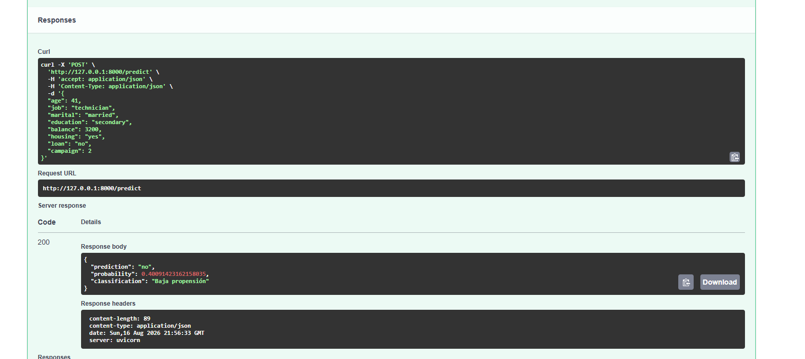
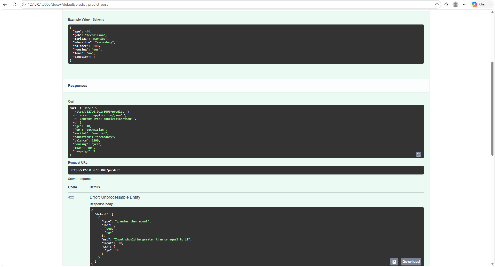
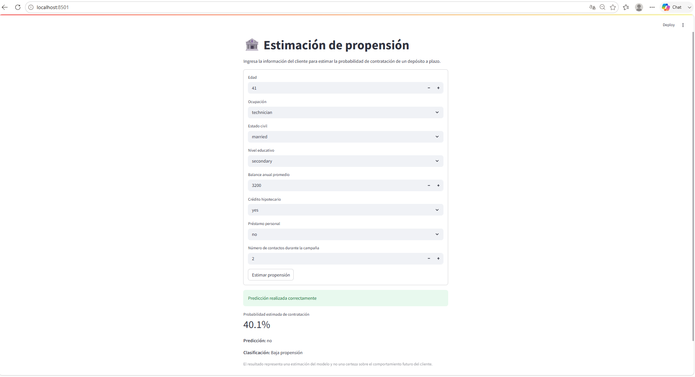

# Mini sistema de inferencia con Regresión Logística

## Descripción del proyecto

Este proyecto implementa una solución básica de inferencia utilizando un modelo de **Regresión Logística** entrenado con el dataset **Bank Marketing** del UCI Machine Learning Repository.

El objetivo del modelo es estimar la probabilidad de que un cliente contrate un depósito a plazo a partir de información disponible antes del contacto comercial.

El proyecto implementa el flujo completo:

**Datos → Preprocesamiento → Entrenamiento → Persistencia → API → Inferencia → Frontend**

La solución separa el entrenamiento del modelo de la etapa de inferencia. El modelo se entrena una sola vez, se guarda en un archivo y posteriormente es utilizado por una API desarrollada con FastAPI.

---

## Arquitectura

La arquitectura general del proyecto es:

```text
Frontend (Streamlit)
        ↓
POST /predict
        ↓
FastAPI
        ↓
Validación con Pydantic
        ↓
Pipeline de preprocesamiento
        ↓
Regresión Logística
        ↓
Predicción + Probabilidad
        ↓
Respuesta JSON
        ↓
Frontend
```

El frontend únicamente captura los datos y consume la API. No contiene el modelo ni realiza directamente la predicción.

---

## Estructura del proyecto

```text
Sistema-de-Inferencia-con-Regresion-Logistica/
│
├── data/
│   └── bank.csv
│
├── training/
│   └── train.py
│
├── models/
│   └── bank_marketing_pipeline.joblib
│
├── app/
│   ├── __init__.py
│   ├── main.py
│   ├── schemas.py
│   └── inference.py
│
├── frontend/
│   └── app.py
│
├── requirements.txt
└── README.md
```

### Responsabilidad de cada componente

* `data/`: contiene el dataset utilizado.
* `training/train.py`: realiza el preprocesamiento, entrenamiento, evaluación y persistencia del modelo.
* `models/`: contiene el pipeline entrenado.
* `app/schemas.py`: define y valida los datos que recibe la API.
* `app/inference.py`: carga el pipeline persistido y realiza las predicciones.
* `app/main.py`: contiene la aplicación FastAPI y el endpoint `/predict`.
* `frontend/app.py`: interfaz desarrollada con Streamlit.
* `requirements.txt`: contiene las dependencias necesarias para ejecutar el proyecto.

---

# Dataset

Se utilizó el dataset **Bank Marketing**, que contiene información de campañas de marketing directo realizadas por una institución bancaria portuguesa.

La variable objetivo es:

```text
y
```

Sus valores posibles son:

* `yes`: el cliente contrató el depósito.
* `no`: el cliente no contrató el depósito.

El dataset utilizado contiene **4,521 registros**.

La distribución de la variable objetivo fue aproximadamente:

* `no`: 88.5%
* `yes`: 11.5%

Por lo tanto, existe un desbalance importante entre las dos clases.

---

## Variables utilizadas

Se seleccionaron las siguientes variables predictoras:

| Variable    | Descripción                                       |
| ----------- | ------------------------------------------------- |
| `age`       | Edad del cliente                                  |
| `job`       | Ocupación                                         |
| `marital`   | Estado civil                                      |
| `education` | Nivel educativo                                   |
| `balance`   | Balance anual promedio                            |
| `housing`   | Indica si tiene crédito hipotecario               |
| `loan`      | Indica si tiene préstamo personal                 |
| `campaign`  | Número de contactos realizados durante la campaña |

La variable `duration` no fue utilizada.

---

# Preprocesamiento

Las variables fueron divididas en numéricas y categóricas.

### Variables numéricas

```text
age
balance
campaign
```

Estas variables fueron procesadas utilizando `StandardScaler`.

### Variables categóricas

```text
job
marital
education
housing
loan
```

Estas variables fueron transformadas utilizando `OneHotEncoder`.

Para mantener el mismo procesamiento durante entrenamiento e inferencia se utilizó un `ColumnTransformer` dentro de un `Pipeline` de Scikit-Learn.

Conceptualmente:

```text
Datos originales
      ↓
ColumnTransformer
   ↓          ↓
Numéricas   Categóricas
   ↓          ↓
Scaler    OneHotEncoder
      ↓
Regresión Logística
      ↓
Predicción
```

---

# División de datos

Los datos se dividieron en:

* 80% para entrenamiento.
* 20% para prueba.

Se utilizó:

```python
stratify=y
```

para conservar aproximadamente la misma proporción de clientes `yes` y `no` en los conjuntos de entrenamiento y prueba.

El resultado fue:

```text
Entrenamiento: 3616 registros
Prueba:         905 registros
```

---

# Entrenamiento del modelo

Se utilizó un modelo de:

```text
LogisticRegression
```

Debido al fuerte desbalance de la variable objetivo, inicialmente el modelo clasificaba todos los registros como `no`.

El primer modelo obtenía aproximadamente 88.5% de accuracy, pero:

```text
Precision = 0
Recall = 0
F1-score = 0
```

Esto demostraba que el accuracy era engañoso, ya que el modelo no identificaba a ningún cliente que realmente hubiera contratado el depósito.

Por esta razón se utilizó:

```python
class_weight="balanced"
```

De esta forma, la clase minoritaria `yes` tiene mayor importancia durante el entrenamiento.

---

# Evaluación del modelo

Las métricas obtenidas con el modelo balanceado fueron:

| Métrica   | Resultado |
| --------- | --------: |
| Accuracy  |     0.610 |
| Precision |     0.161 |
| Recall    |     0.567 |
| F1-score  |     0.251 |

## Interpretación

### Accuracy

El modelo clasificó correctamente aproximadamente el **61% de los clientes del conjunto de prueba**.

El accuracy disminuyó respecto al primer modelo, pero esto no significa necesariamente que el modelo haya empeorado, ya que ahora sí intenta identificar clientes pertenecientes a la clase minoritaria.

### Precision

La precision obtenida fue aproximadamente **16.1%**.

Esto significa que, de los clientes que el modelo clasificó como potencialmente interesados, aproximadamente 16% realmente contrataron el depósito.

Esto indica que existen una cantidad importante de falsos positivos.

### Recall

El recall fue aproximadamente **56.7%**.

Esto significa que, de todos los clientes que realmente contrataron el depósito, el modelo logró identificar aproximadamente el 57%.

### F1-score

El F1-score fue aproximadamente **25.1%**.

Esta métrica combina precision y recall. El resultado refleja que el modelo tiene capacidad para detectar parte de los clientes interesados, pero todavía tiene margen de mejora, especialmente debido al número de falsos positivos.

El objetivo de este proyecto no fue optimizar al máximo el desempeño del modelo, sino implementar correctamente el flujo completo de una solución de inferencia.

---

# Matriz de confusión

La matriz de confusión obtenida fue:

```text
[[493 308]
 [ 45  59]]
```

Interpretación:

|          | Predicción NO | Predicción YES |
| -------- | ------------: | -------------: |
| Real NO  |           493 |            308 |
| Real YES |            45 |             59 |

Por lo tanto:

* 493 verdaderos negativos.
* 308 falsos positivos.
* 45 falsos negativos.
* 59 verdaderos positivos.

---

# Persistencia del modelo

El pipeline completo fue almacenado utilizando `joblib` en:

```text
models/bank_marketing_pipeline.joblib
```

El archivo contiene tanto el preprocesamiento como el modelo entrenado.

Conceptualmente:

```text
bank_marketing_pipeline.joblib
│
├── StandardScaler
├── OneHotEncoder
└── LogisticRegression
```

Esto permite que durante inferencia se utilicen exactamente las mismas transformaciones utilizadas durante el entrenamiento.

El modelo no se vuelve a entrenar cuando se realiza una solicitud a la API.

---

# API de inferencia

La API fue desarrollada utilizando **FastAPI**.

El endpoint principal es:

```text
POST /predict
```

La solicitud debe contener las ocho variables utilizadas por el modelo.

Ejemplo:

```json
{
  "age": 41,
  "job": "technician",
  "marital": "married",
  "education": "secondary",
  "balance": 3200,
  "housing": "yes",
  "loan": "no",
  "campaign": 2
}
```

Ejemplo de respuesta obtenida:

```json
{
  "prediction": "no",
  "probability": 0.40091423162158035,
  "classification": "Baja propensión"
}
```

En este ejemplo, el modelo estima aproximadamente una probabilidad de **40.1% para la clase `yes`**.

---

# Validación de datos

La API utiliza Pydantic para validar los datos recibidos antes de realizar la inferencia.

Por ejemplo:

```python
age: int = Field(ge=18, le=100)
```

permite validar que la edad sea un número entero dentro de un rango razonable.

También se valida que:

```python
campaign >= 1
```

Esto permite rechazar solicitudes inválidas antes de enviarlas al modelo.

### Ejemplo de dato inválido

```json
{
  "age": -10,
  "job": "technician",
  "marital": "married",
  "education": "secondary",
  "balance": 3200,
  "housing": "yes",
  "loan": "no",
  "campaign": 2
}
```

La API rechaza esta solicitud debido a que la edad se encuentra fuera del rango permitido.

También se rechazan valores con tipos incorrectos, por ejemplo:

```text
age = "hola"
```

---

# Frontend

Se desarrolló un frontend sencillo utilizando **Streamlit**.

La interfaz permite capturar:

* Edad.
* Ocupación.
* Estado civil.
* Nivel educativo.
* Balance.
* Crédito hipotecario.
* Préstamo personal.
* Número de contactos realizados.

Al presionar:

```text
Estimar propensión
```

el frontend construye los datos del cliente y realiza una solicitud HTTP:

```text
POST /predict
```

a la API.

El frontend no realiza ninguna predicción directamente.

El flujo real es:

```text
Streamlit
    ↓
POST /predict
    ↓
FastAPI
    ↓
Pipeline
    ↓
Regresión Logística
    ↓
Respuesta JSON
    ↓
Streamlit
```

---

# Instalación

## 1. Clonar el repositorio

```bash
git clone https://github.com/anareyes06/Sistema-de-Inferencia-con-Regresi-n-Log-stica
```

Entrar a la carpeta del proyecto:

```bash
cd Sistema-de-Inferencia-con-Regresi-n-Log-stica
```

## 2. Instalar dependencias

```bash
python -m pip install -r requirements.txt
```

---

# Ejecución

## Entrenar nuevamente el modelo

En caso de necesitar volver a entrenar el modelo:

```bash
python training/train.py
```

Esto genera:

```text
models/bank_marketing_pipeline.joblib
```

---

## Ejecutar la API

Desde la raíz del proyecto:

```bash
python -m uvicorn app.main:app --reload
```

La API estará disponible en:

```text
http://127.0.0.1:8000
```

La documentación interactiva de FastAPI se encuentra en:

```text
http://127.0.0.1:8000/docs
```

---

## Ejecutar el frontend

Manteniendo la API en ejecución, abrir una segunda terminal y ejecutar:

```bash
python -m streamlit run frontend/app.py
```

El frontend estará disponible normalmente en:

```text
http://localhost:8501
```

Es necesario mantener tanto FastAPI como Streamlit ejecutándose para que el flujo completo funcione.

---

# Evidencia de funcionamiento

## Caso A — Inferencia válida

Se realizó una solicitud válida utilizando el endpoint:

```text
POST /predict
```

Con los siguientes datos:

```json
{
  "age": 41,
  "job": "technician",
  "marital": "married",
  "education": "secondary",
  "balance": 3200,
  "housing": "yes",
  "loan": "no",
  "campaign": 2
}
```

La API respondió correctamente con código HTTP `200` y una probabilidad estimada de aproximadamente 40.1%.

**Evidencia:**



---

## Caso B — Inferencia con error

Se realizó una solicitud utilizando:

```text
age = -10
```

La API rechazó la entrada debido a que la edad se encontraba fuera del rango válido definido por el esquema.

**Evidencia:**



---

## Caso C — Frontend

Se ingresaron los datos del cliente desde la interfaz desarrollada en Streamlit.

El frontend realizó una solicitud real al endpoint `/predict` y mostró el resultado recibido desde la API:

```text
Probabilidad estimada de contratación: 40.1%
Predicción: no
Clasificación: Baja propensión
```

**Evidencia:**



---

# Preguntas

## 1. ¿Por qué el modelo se entrena fuera de la API y no dentro de `/predict`?

El entrenamiento y la inferencia son procesos diferentes.

El entrenamiento puede ser un proceso costoso porque requiere cargar todos los datos, realizar el preprocesamiento y ajustar los parámetros del modelo.

Si el modelo se entrenara dentro de `/predict`, cada solicitud provocaría un nuevo entrenamiento, haciendo que la API fuera mucho más lenta e innecesariamente costosa.

Por esta razón, el modelo se entrena una sola vez y se almacena. Durante inferencia, la API únicamente carga el pipeline entrenado y utiliza `predict()` y `predict_proba()`.

---

## 2. ¿Por qué es importante utilizar durante inferencia exactamente el mismo preprocesamiento utilizado durante entrenamiento?

El modelo fue entrenado utilizando una representación específica de los datos.

Por ejemplo, las variables numéricas fueron escaladas y las variables categóricas fueron convertidas utilizando One-Hot Encoding.

Si durante inferencia se utilizaran transformaciones diferentes, los datos enviados al modelo tendrían una representación distinta a la que observó durante entrenamiento y las predicciones podrían ser incorrectas o incluso producir errores.

Por esta razón se almacena el preprocesamiento y la Regresión Logística dentro del mismo Pipeline.

---

## 3. ¿Qué diferencia existe entre `predict()` y `predict_proba()` en este problema?

`predict()` devuelve directamente la clase que el modelo selecciona.

En este problema puede devolver:

```text
yes
```

o:

```text
no
```

En cambio, `predict_proba()` devuelve las probabilidades estimadas para cada clase.

Por ejemplo:

```text
no  = 0.28
yes = 0.72
```

Esto permite mostrar al usuario no solamente la clasificación final, sino también el nivel de propensión estimado por el modelo.

---

## 4. Si el modelo devuelve una probabilidad de 0.72, ¿qué significa ese valor y qué NO significa?

Una probabilidad de:

```text
0.72
```

para la clase `yes` significa que, de acuerdo con el modelo y con las características ingresadas, la probabilidad estimada asociada a que el cliente contrate el depósito es de 72%.

Sin embargo, este valor no significa que exista certeza de que el cliente contratará el producto.

La predicción depende del modelo, los datos utilizados para entrenarlo, las variables disponibles y sus limitaciones.

Por lo tanto, debe interpretarse como una estimación y no como una garantía sobre el comportamiento futuro del cliente.

---

## 5. ¿Por qué `duration` no debería utilizarse en este sistema si queremos hacer la predicción antes de contactar al cliente?

La variable `duration` representa la duración de la llamada con el cliente.

Este dato únicamente se conoce después de que el contacto ya ocurrió.

Si el objetivo es estimar la propensión antes de realizar la llamada, esta información todavía no estaría disponible en el momento de hacer la predicción.

Utilizarla durante entrenamiento generaría una inconsistencia entre la información disponible durante entrenamiento y la información disponible durante inferencia.

También podría provocar un problema de fuga de información o **data leakage**, haciendo que el desempeño aparente del modelo fuera artificialmente mejor.

---

## 6. ¿Qué ocurriría si mañana cambia la estructura de los datos enviados por el frontend?

La API espera una estructura específica definida mediante el modelo `ClientData`.

Si el frontend cambia los nombres de las variables, elimina campos obligatorios o modifica los tipos de datos sin actualizar la API, la validación rechazará la solicitud.

Por ejemplo, si en lugar de:

```text
age
```

el frontend empieza a enviar:

```text
client_age
```

la API no reconocerá ese campo como sustituto de `age`.

Por esta razón, frontend y API deben mantener un contrato de datos claramente definido.

Si la estructura cambia de forma intencional, se debe actualizar el esquema de la API y verificar si el pipeline y el modelo también necesitan modificaciones.

---

# Conclusión

El proyecto permitió implementar el ciclo completo de una solución básica de inferencia de Machine Learning.

A diferencia de utilizar un modelo únicamente dentro de un notebook, esta solución separa claramente las responsabilidades de entrenamiento, persistencia, validación, inferencia y presentación de resultados.

El modelo es entrenado previamente y almacenado junto con su preprocesamiento. Posteriormente, FastAPI expone la capacidad de inferencia mediante un endpoint, mientras que Streamlit actúa como consumidor de la API.

El resultado final permite observar claramente el flujo:

```text
Frontend → API → Validación → Pipeline → Regresión Logística → Probabilidad → Respuesta
```

Además, el ejercicio demuestra que una métrica alta como accuracy no siempre implica que un modelo sea útil. Debido al desbalance del dataset, fue necesario analizar también precision, recall y F1-score para comprender correctamente el comportamiento del modelo.